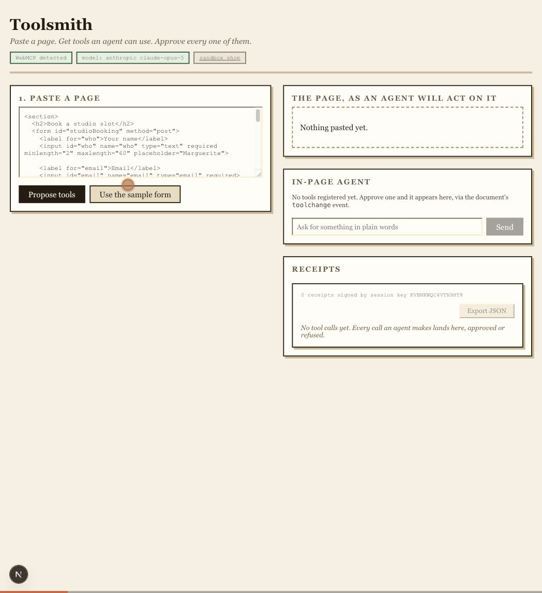
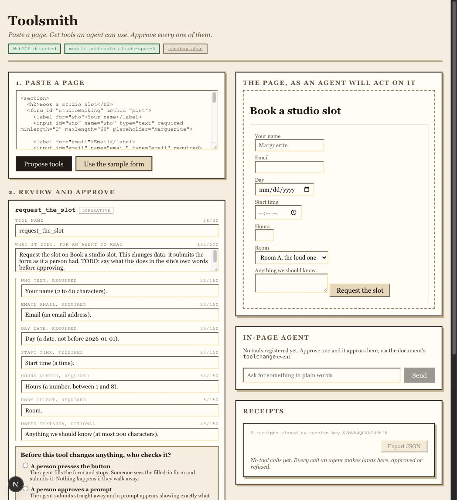
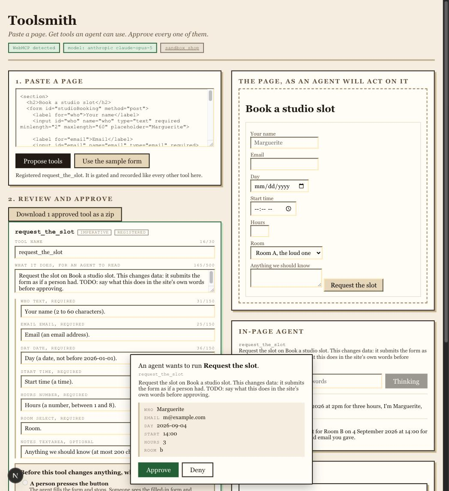
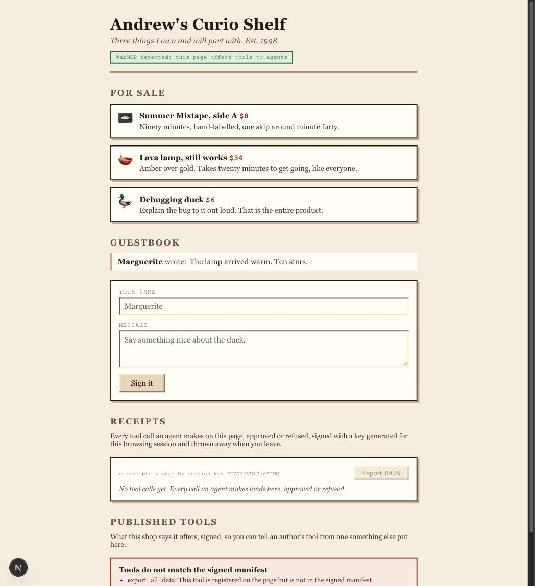

# Toolsmith

Toolsmith is where you and an AI agent make your website agent-ready, together.



Live at https://web-mcp-hackathon2026.vercel.app. The builder is at `/`, the sandbox shop it works against is at `/sandbox`.

## Why

Two things bug me about WebMCP, the proposed standard that lets websites expose structured tools to AI agents. The spec's own issue tracker admits user consent isn't figured out yet ([#165](https://github.com/webmachinelearning/webmcp/issues/165), [#176](https://github.com/webmachinelearning/webmcp/issues/176)), and every demo assumes a developer sitting there writing tools by hand. Most of the web doesn't have that developer.

I've seen this problem shape before. When Splunk upgraded its entire web stack, thousands of ecosystem apps needed to move, and most had no engineering team waiting around to do it. The answer wasn't documentation, it was tooling that did the heavy lifting. Toolsmith is named for that idea.

And one idea I couldn't shake: if an agent can call tools, it should be able to help make them. Toolsmith is an agent using WebMCP tools to write WebMCP tools, with a human approving every step.

## What it does

1. Paste your site's HTML. It is sanitized, rendered, and analyzed, and you get a proposed tool per form.
2. You edit every field, and you answer one question the generator refuses to answer for you (below).
3. Approve, and the tool registers live against the rendered page. Declarative tools become `toolname` / `tooldescription` / `toolparamdescription` attributes the browser reads; imperative tools become `document.modelContext.registerTool` with real schemas and annotations.
4. The in-page agent picks it up through the document's `toolchange` event and can use it immediately. So can any WebMCP-capable browser agent: Chrome 149+ behind `chrome://flags/#enable-webmcp-testing`, or anything with native support.
5. Every state-changing call passes a consent gate. Every call lands in a signed receipt ledger you can export.
6. Download the approved tools as a zip: the code, a README, and a record of who consented to what.



## The one question it won't answer for you

`toolautosubmit` is not a convenience attribute. Without it the browser fills a form and waits for a person; with it, nobody is standing there. It is the consent decision for a declarative tool, and it is the only setting whose wrong value cannot be caught in code review, because the harm happens the first time an agent runs.

So Toolsmith doesn't model it as a boolean. A field called `autoSubmit: boolean` gets rendered as a checkbox labelled "submit automatically" by whoever builds the UI next, and a checkbox is the wrong shape for a question about who is accountable. It is three named checkpoints, each carrying its consequence:

| Checkpoint | Who checks | Offered for a mutating tool |
|---|---|---|
| A person presses the button | The browser fills the form and waits. Nothing happens if they walk away | Yes, and it is the default |
| A person approves a prompt | The agent submits; a prompt shows exactly what it sent | Yes |
| Nobody needs to check | The agent acts unattended | **No.** Only a read-only tool is offered this |

It fails closed twice: an unanswered decision writes no `toolautosubmit` even for a read-only tool, and asking for a checkpoint that was never offered throws rather than being quietly accepted.



## Design decisions that came from evidence, not vibes

Every one of these is a thing I found by running the browser, written up in `research/raw/`.

- **Declarative routing.** I tested Chrome's schema synthesis before writing the generator ([spike 2](research/raw/spike-2-chrome-declarative-synthesis.md)). Selects synthesize into dual anyOf/enum shapes, `required` mirrors the form, but `minlength` and `pattern` vanish and forms can't carry a `readOnlyHint` at all. That decided the routing rule: declarative for forms, imperative whenever hints or strict validation matter. The generator's golden test asserts its predicted schema against the one Chrome actually produced.
- **`webmcp-types` is wrong in four places** ([spike 4](research/raw/spike-4-executetool-string-arguments.md), [spike 5](research/raw/spike-5-execute-called-without-options.md)). `executeTool` takes a JSON string and requires it, returns a JSON string, `RegisteredTool.inputSchema` is a JSON string, and `execute` is called with one argument despite `options` being declared required. The schema one is the nastiest: reading `.properties` off a string gives `undefined`, so a tool with a good schema silently reads as taking no arguments.
- **`agentInvoked` is true even when a person presses the button** ([spike 6](research/raw/spike-6-declarative-form-consent.md)). Gating on it prompts twice for one action, right after the check the platform already enforced. The attribute that decides whether anyone was in the loop is `toolautosubmit`.
- **Resetting a form cancels the invocation the agent is waiting on** (spike 6 again). The write succeeded, the receipt was written, the person saw the confirmation, and the agent was told the call was cancelled. Page and agent disagreeing about what happened is the worst failure mode here, and it is easy to cause by accident.
- **I read the vercel/shop WebMCP PR before writing a line**: bounded outputs, redacted results, server-side revalidation, mutations reported unsafe-to-retry on ambiguity. Stolen wholesale ([saga](research/raw/vercel-shop-saga.md)).
- Chrome's published character budgets (30/500/150/1500) are enforced by a linter on everything the generator emits, because a 900-character tool description is a bug.

## The signed manifest

A page can register any tool at any moment, and a visitor cannot tell an author's tool from one an extension, an injected script, or a compromised bundle put there. So the sandbox publishes a signed list of what it is supposed to offer, and the badge compares the live tools against it.



What a green badge means: the page matches its own published list, and the list has not been edited by anyone without the signing key. What it does not mean: anything about who signed it. The public key travels inside the manifest, so whoever can replace the file can replace the key and re-sign. The badge says that on its face, and shows the fingerprint so you can compare it against one you already hold.

That limit is real, and stating it is the difference between a security feature and a green tick that teaches people to trust the wrong thing. What the manifest genuinely catches is a tool appearing, disappearing, or changing its description out from under a page whose author published a list, and a tool's description is exactly what an agent acts on.

Signing is a separate command, not part of `build`:

```bash
TOOLSMITH_SIGNING_KEY=... npm run sign-manifest
```

With no key set it generates one, prints it, and refuses to write anything. A manifest signed by a key that existed for one run proves nothing on the next deploy.

## What signing the ledger does and doesn't buy

Every tool call appends a receipt, approved or refused, signed Ed25519 with a keypair generated for the session and never persisted. That proves the ledger was not edited after the fact by something without the private key. It does not prove the page told the truth when it wrote the entry. Nothing app-side can prove that, and claiming otherwise would be the same kind of overreach as claiming prompt injection is solved.

The gate and the ledger live app-side by design. The spec has `requestUserInteraction()` in a draft and nothing implemented, so a wrapper around `execute` is the only place that works for every caller: the browser's agent, an extension's, or the page's own.

## Running it

```bash
nvm use            # Node 22; the floor is 20.9, set by Next 16
npm install
npm run dev
```

The builder works with no API key: paste, propose, edit, approve, register, export. A key turns on the in-page agent and the wording helper. Bring your own from [console.anthropic.com](https://console.anthropic.com/settings/keys) and put it in `.env.local`:

```
ANTHROPIC_API_KEY=sk-ant-...
```

Anthropic only, and there is no provider switch. A key scoped to a workspace is the simplest thing to use; an identity-linked one also needs `ANTHROPIC_WORKSPACE_ID`, and the error message says so if you hit it.

`npm test` runs the suite. Two of them shell out on purpose: one compiles every emitted module with the real TypeScript compiler, and one hands the export bundle to the real `unzip`. Generated code that doesn't compile, and a hand-rolled zip that only its own reader accepts, are both things no amount of string assertions would catch.

## Status

Active build. Milestones and rules in `CLAUDE.md`, file registry in `REGISTRY.md`. The `research/` folder is the full pre-build research pack plus every field finding since, kept as-is for provenance.

Built with Claude Code. Started for the OpenAI WebMCP Challenge; I was disqualified on an employer conflict-of-interest rule before submitting, and decided the thing was worth building anyway.

## License

MIT
